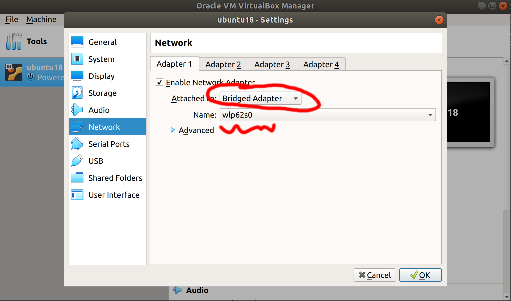

<p align="center">
  <a href="" rel="noopener">
 </a>
</p>

<h3 align="center">Software Development for Robotics</h3>

<div align="center">

  []() 
  []()
  [](/LICENSE)

</div>

---

<p align="center"> Class Notes
</p>


## ✍️ Notes <a name = "rosinstall"></a>
### 2019/10/07
**check IP address:**
- ifconfig    (linux)
- ipconfig    (windows)

**communicate your VirtualBox with ROS Master on other PC:**


**Setup your connection with ROS Master:**
- gedit ~/.bashrc **OR** nano ~/.bashrc
    - Enter these at the Bottom of your ~/.bashrc script:
        - ```
            export ROS_IP=your.ip.address.here
            export ROS_MASTER_URI=http://master.ip.address.here:11311
            export ROS_HOSTNAME=your.ip.address.here
        ```

**Turtlebot3 Test and Play:**

official manual page: http://emanual.robotis.com/docs/en/platform/turtlebot3/simulation/#turtlebot3-simulation-using-fake-node
1. install: 
```sudo apt install ros-melodic-turtlebot3* ros-melodic-teleop-twist-keyboard ```

2. Run Simulation: (you can run both on your PC when you test on your own)
    - **one PC:**
    ```
    export TURTLEBOT3_MODEL=waffle_pi
    roslaunch turtlebot3_gazebo multi_turtlebot3.launch
    ```
    - **another PC:**
    ```
    rosrun teleop_twist_keyboard teleop_twist_keyboard.py cmd_vel:=tb3_2/cmd_vel
    ## check the instruction show up on terminal when you run this code and try to control the robot.
    ```
    